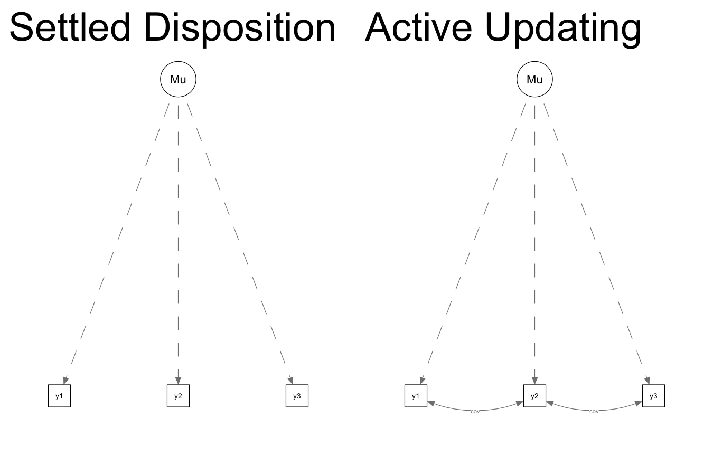
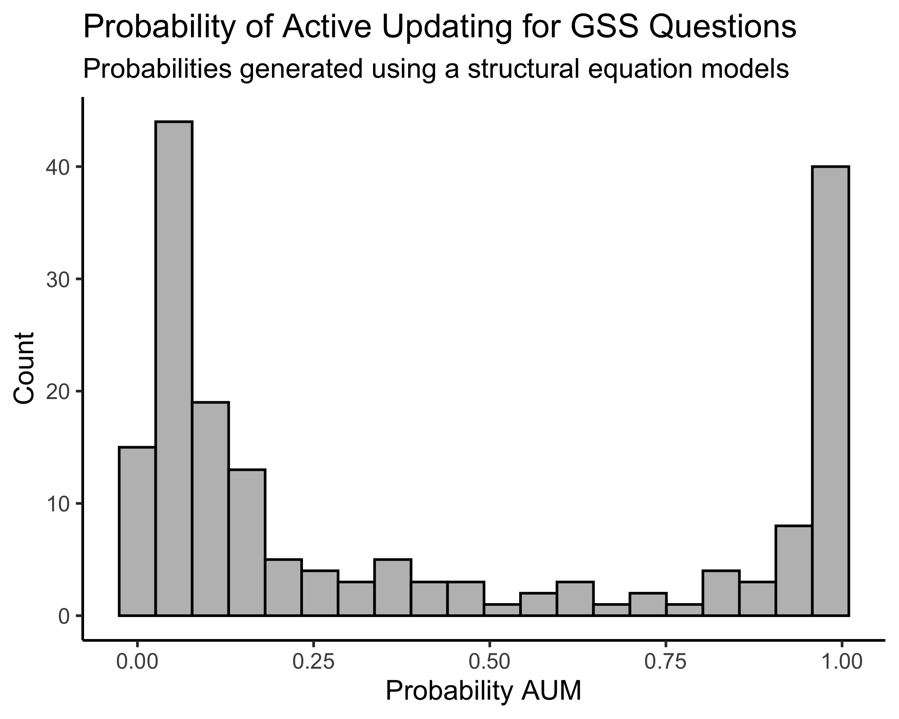

My [previous post](https://krkiley.github.io/blog/nobody_changes/) outlined perhaps the most basic approach to comparing the Settled Disposition Model (SDM) and Active Updating Model (AUM): counting whether there were more cases of persistent change than anticipated under the settled dispositions model. But that was not our first approach. 

We began the project by comparing two structural equation models, presented below, for each attitude and behavior measure in the GSS. We represent the difference between the two data-generating processes slightly differently in this presentation than in the paper. In this structure, we ask: Once we control for the average response across the three waves, are the residuals for adjacent waves correlated? If changes at each wave are more-or-less temporary or random departures (as assumed under the SDM), there should be no correlation between residuals once we control for a person's mean. If people are changing in persisting ways (as assumed in the AUM), adjacent waves will have non-zero correlation.

To this end, the SEM for the active updating model (on the right) includes one more parameter than the settled dispositions model (on the left): a term that allows the covariance of the residuals for adjacent waves to be non-zero. This term constrained to be equal for both pairs of adjacent waves (1-2 and 2-3).

Similar to what we do in the paper when we compare two regression models, one with a constraint and one without, we can compare the BICs of both structural equation models to estimate a probability that one model fits better than the other. That distribution is presented below.

In contrast to the distribution of probabilities we present in the paper, which found that about 60 percent of questions showed some evidence of persistence (or favoring the active updating model), the SEM approach finds only about 34 percent of questions show evidence of persistence. About two-thirds of questions are classified the same in both models. Almost all items that are classified differently in the two models show evidence of persistence in the regression model but no significant evidence of persistence in the SEM model. What explains the 58 items that differ between the two models?

The model used in the paper, similar to the previous post, focuses primarily on using waves 1 and 2 to predict wave 3. In contrast, the SEM approach looks at the overall pattern of responses over all three waves and evaluates how well they conform to the two data-generating models. 

Consider the following example. We ask people a question with a binary (yes/no) response option. There are three types of cases with the same "mean" response (.66): 0-1-1, 1-0-1, and 1-1-0 (the converse patterns also exist: 1-0-0, 0-1-0, and 0-0-1). The regression approach only considers the first two patterns and evaluates whether the first occurs more often than the second. In the third pattern, both wave 1 and wave 2 make the same (wrong) prediction for wave 3, so they cannot help adjudicate the overall pattern. However, in the SEM context, the settled dispositions model actually predicts that all three of these patterns will occur in roughly the same proportion, while the active updating model predicts that the first and last patterns will each occur more often than the middle pattern.

In the example above, if 0-1-1 occurs much more frequently than 1-0-1, but 1-1-0 occurs much less frequently, the SEM model will predict no persistence where the regression model will. In other words, the 1-1-0 patterns can "balance" out 0-1-1 patterns in the SEM approach.

This appears to be the case for some of the variables that differ between the two models, such as the "abortion in the case of rape" question (abany). Of people who change between the first two waves, 111 revert to their wave 1 response while 149 persist in their new response, which appears to provide evidence for active updating in the regression model. However, the number of people who give a different response in wave 3 is only 128, weakening the evidence of persistence to make it non-significant.

Second, the SEM approach does not include an intercept for each wave, which the regression approach used in the paper does. In this way, it is similar to the counting measure shown in the previous post. While one might expect that this would result in more evidence of persistence, as the SEM approach can capture population-wide change in a single direction that the regression approach does not, we actually see the opposite. In the regression model, a small group of people making large changes in one direction can make other people persist *relative to the population mean* even when they do not change their responses. 

Despite these differences, it is important to note that the overall picture is quite similar to what we find in the paper (if it wasn't, we probably wouldn't have published the paper). When we look at the results of this approach, the approach we use in [the paper](https://krkiley.github.io/publication/measuring-change-and-stability-in-personal-culture-using-panel-data/), and the approach I outlined in the [previous post](https://krkiley.github.io/blog/nobody_changes/): for most items measuring during the GSS panels from 2006 to 2014, it is hard to make the case that some meaningful proportion of people changed their view in a persisting way.